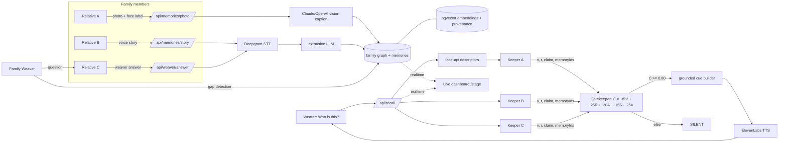

# Kin

**The family doesn't train an AI. The family remembers together.**

Kin gives a family a collective memory. Each relative has a **Keeper** grounded
only in the photos, voice notes, and stories they contributed. When a person
with early-stage dementia taps one button and asks "who is this?", the Keepers
independently retrieve evidence, a deterministic **Gatekeeper** scores it, and
Kin whispers a short cue through the phone only when the evidence agrees.
Otherwise it stays silent. A **Family Weaver** finds gaps in the family memory
graph and asks the relative most likely to know.

Kin is a family memory and reminiscence-support prototype. It is not a medical
device and makes no clinical claims.

## How it works

- Each relative has a **Keeper**, an agent grounded only in that person's
  contributed photos, voice notes, and stories.
- A deterministic **Gatekeeper** scores Keeper evidence with the formula
  `C = 0.35V + 0.25R + 0.20A + 0.15S - 0.25X`. It returns SPEAK only when
  `C >= 0.80` with strong enrolled-face matches from at least two relatives and provenance; otherwise it returns SILENT.
- The **Family Weaver** detects gaps in the family graph (a missing origin, an
  orphan object, an unrelated person) and asks the relative most likely to know.

## Architecture



## Stack

Next.js 15.5 (App Router, TypeScript), Tailwind, Supabase (Postgres + pgvector +
Storage + Realtime), face-api in the browser, Claude or OpenAI (vision and extraction; optional OpenAI embeddings), Deepgram (STT), ElevenLabs (TTS), Vitest, Playwright.

## App

- `/signup`, `/signin`: email/password accounts, email confirmation and password reset.
- `/onboarding`: create an empty family library or join an invitation.
- `/family`: shared photos and recordings. Preview recordings before saving; delete your own contributions.
- `/wearer`: camera permission on request, one large “Who is this?” action, readable and spoken cues.
- `/stage`: Connections canvas, recognition result, family sources, questions, and optional diagnostics.
- `/settings`: family invitations, larger text, reduced motion, account and sign-out.

## Setup

1. Run the Supabase migrations in order in the SQL editor:
   `001_init.sql`, `002_demo_reliability.sql`, `003_accounts.sql`, then
   `004_loved_one_invites.sql` in `supabase/migrations/`.
   Existing projects run only migrations they have not applied.
2. Copy `.env.example` to `.env.local` and supply Supabase URL, anon key, service-role
   key, OpenAI or Anthropic key, and Deepgram key. ElevenLabs is optional; browser
   speech is the fallback. All provider and service-role keys stay server-side.
3. In Supabase **Authentication → URL Configuration**, set the Site URL to the app
   origin and add its callback URL to Redirect URLs, for example
   `http://localhost:3100/auth/callback` and
   `http://localhost:3100/auth/callback?next=/update-password`.
   Add your HTTPS deployment/tunnel URLs when using those. Email confirmation is
   enabled by default. Email delivery uses your Supabase project's mail settings.
4. Install and start:

   ```bash
   npm ci
   npm run dev -- -p 3100
   ```

5. Open `http://localhost:3100/signup`, create an account, confirm your email, and
   create a family. Invite relatives from Settings. Each person signs in with
   their own account; there is no identity picker and no automatic sample data.
   Use **Invite [loved one’s name]** for the person using recognition. That link
   creates their separate recognition account, without a contributor or Keeper.
   It can be used once; ordinary contributor invitations remain reusable.

Production locally: `npm run build`, then `npm run start -- -p 3100`.
`npm run seed` is a legacy developer fixture tool, not part of app setup. Do not
run it against a family you want to keep. In-app seed/reset endpoints are disabled.

Family APIs derive the family and contributor from a verified Supabase session.
RLS blocks anonymous and other-family reads. Loved-one accounts can recognize
people and change their display preferences; contribution APIs reject their writes. Media uses a private bucket and
short-lived signed URLs, issued only after the server checks membership.

### Phones need HTTPS

Camera and microphone require a secure context. For local phone testing:

```bash
ngrok http 3100
```

and open the ngrok URL on the phone. To deploy, use Vercel (`vercel deploy`)
and set the same env vars in the project.

## Demo behavior

Follow [DEMO.md](DEMO.md) for service setup, sample recordings, the timed
three-minute sequence, and the live acceptance checklist.

Person recall uses explicitly enrolled faces and exact graph provenance. It
requires two relatives to match the same person. Semantic similarity cannot
identify a person; no face, ambiguous faces, and unknown faces remain silent.
The retrieval signal is 1 only when the enrollment's photo is linked to the
recognized person and owned by the Keeper. The score is a heuristic, not a
calibrated probability.

Anthropic mode makes no OpenAI requests. It stores zero-vector placeholders in
the existing embedding column; these are not semantic embeddings. The current
person demo uses face descriptors and graph provenance instead. OpenAI mode
continues to create semantic embeddings during ingestion.

Spoken context is an attributed verbatim excerpt from a family recording.
Relevant Weaver answers take priority, making the new detail audible on replay.
Stage's “Replay known person” reuses the last successful recognition, even after
an unknown-face attempt, and plays the new cue on the presenting device.

## Unfolding a family story

In **Memories** or **Connections**, choose **Unfold the story**. Pull the photograph
up, or tap it, to separate a shared tradition into family perspectives. Open a
perspective to read its complete source or play its original recording. On phones,
scroll down through the recollections to the unfinished connection.

The scene uses existing memory and graph provenance. It prefers a tradition with
an open origin question, then one with the most contributors. The invited relative
can record and preview an answer inside the missing-piece panel. Other relatives
see the saved answer through the existing live refresh. A connection completes
only when a source-backed origin, started-by, or taught-by relationship exists;
an uncertain answer stays visible without closing the gap. No generated narration
or automatic audio playback is added. Empty libraries do not show a scene.

## Rust handoff

See [RUST_HANDOFF.md](RUST_HANDOFF.md) for module boundaries, HTTP contracts,
invariants, and known limitations. [VERIFICATION.md](VERIFICATION.md) records
what the automated checks cover and what still needs a real device.

## Tests

```bash
npm test           # vitest: gate, keepers, synthesize, weaver
npx playwright install chromium
npm run test:e2e   # UI/accessibility, real auth/invites, camera/model/audio regression
npm run test:db    # Linux + Docker; isolated pgvector/PostgREST, mocked providers
```

Browser tests require the configured Supabase project and migrations 003–004. They
create confirmed temporary test accounts (no emails), use browser fixtures for
visual checks, and clean up the temporary accounts/families afterward. The database
suite uses disposable local services and never touches your Supabase project.

The UI follows the supplied apple-design guidance: system type, a content-first
library, desktop sidebar/mobile tabs, translucent chrome, and interruptible spring
sheets. It supports keyboard navigation, reduced motion/transparency, increased
contrast, and larger text. Automated checks supplement real device testing.

## Responsible design

- **Early-stage only.** Kin is for people who are still independent and lose
  small pieces of everyday context. It gives the smallest possible cue so the
  wearer reconnects the dots themselves. It does not diagnose, monitor, or
  replace memory.
- **Consent for faces.** A photo cannot be submitted without checking the photo/face-recognition permission box. Face
  descriptors stay in the family's own database; no face is ever sent to a
  model for identification (the vision prompt describes, never identifies).
- **Silence over guessing.** Two outcomes only: SPEAK when independent family
  evidence agrees, SILENT otherwise. There is no "I think this might be..."
- **Not a medical device.** No clinical claims, no reminders, no tracking.
  Just the family, remembering together.
