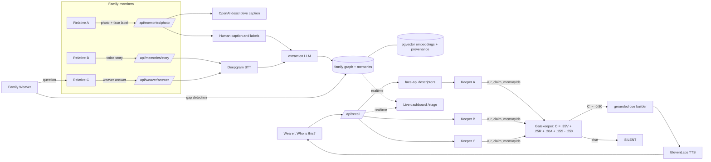

# Kin

**The family doesn't train an AI. The family remembers together.**

Kin gives a family a collective memory. Each relative has a **Keeper** grounded
only in the photos, voice notes, and stories they contributed. When a person
with early-stage dementia taps one button and asks "who is this?", the Keepers
independently retrieve evidence, a deterministic **Gatekeeper** scores it, and
Kin whispers a short cue through the phone only when the evidence agrees.
Otherwise it stays silent. A **Family Weaver** finds gaps in the family memory
graph and asks the relative most likely to know.

Kin is a family memory and reminiscence-support prototype. It is not a medical
device and makes no clinical claims.

## Current integration status (2026-09-19)

The source builds, but the closed demo loop is not connected yet. New ingestion
requires Supabase bearer sessions and the proposed atomic ingestion migration;
existing Family clients still use the old contract. Server face enrollment exists,
but recall imports a disconnected placeholder instead of that provider. No native
mobile app or real demo fixture media is included.

Start with [PARALLEL_PLAN.md](PARALLEL_PLAN.md),
[API_CONTRACT.md](API_CONTRACT.md), and [KNOWN_ISSUES.md](KNOWN_ISSUES.md).
The intended P0 policy is face-only, threshold **0.85**, at least **two distinct
supporting Keepers**, human provenance and no material contradiction. Current
runtime remains **0.80** and permits a single Keeper; this planning checkpoint
does not change behavior. Every cue must be evidence-grounded. Scores are
heuristics, not calibrated identity probabilities.

## How it works

- Each relative has a **Keeper**, an agent grounded only in that person's
  contributed photos, voice notes, and stories.
- The current deterministic **Gatekeeper** scores Keeper evidence with the formula
  `C = 0.35V + 0.25R + 0.20A + 0.15S - 0.25X`. It returns SPEAK only when
  `C >= 0.80` with its existing agreement/provenance checks; otherwise SILENT.
  The stricter intended P0 requirements above remain implementation work.
- The **Family Weaver** detects gaps in the family graph (a missing origin, an
  orphan object, an unrelated person) and asks the relative most likely to know.

## Architecture

This diagram summarizes existing components, not a verified integrated runtime.
Server ingestion now uses bearer authorization, human-only extraction sources,
and commit_ingestion. Vision captions are separate descriptive metadata. Face
enrollment uses an external versioned service; recall's current server adapter
is still a placeholder. See API_CONTRACT for the exact current/target paths.



## Stack

Next.js 14 (App Router, TypeScript), Tailwind, Supabase (Postgres + pgvector +
Storage + Realtime), legacy browser face-api plus a server HTTP face adapter,
OpenAI (vision, extraction, embeddings, question/cue phrasing), Deepgram (STT),
ElevenLabs (TTS), Vitest, Playwright. The separate inference service still needs
its own pinned native dependencies/deployment; root npm ci does not install them.

## Surfaces

- `/family`: relatives contribute photos and stories, and answer Weaver
  questions.
- `/wearer`: one-button recall for the wearer ("Who is this?").
- `/stage`: live dashboard showing keeper scores, gate signals, and the family
  graph in real time.

## Setup

1. **Supabase**: the existing HackMIT project already has migration 001.
   Apply migrations **002, 003, 004, 005**, in order, in the SQL editor.
   See [demo reconciliation](docs/demo-reconciliation.md) for exact files and the
   consolidation safeguards. Do not rerun 001 on this existing project.

2. **Env vars**: `cp .env.example .env.local` and fill in Supabase URL + keys
   (Project Settings → API), `OPENAI_API_KEY`, `OPENAI_MODEL` (a current
   multimodal model), `DEEPGRAM_API_KEY`, `ELEVENLABS_API_KEY`, and
   `ELEVENLABS_VOICE_ID`. Configure `KIN_FACE_SERVICE_URL`,
   `KIN_FACE_SERVICE_TOKEN`, `KIN_FACE_TOKEN_KEY` for server enrollment. See
   [ingestion handoff](docs/agent-2-ingestion.md) for service/auth setup. Keep
   comments on separate lines because the current seed env parser is simple.
   KIN_GATE_THRESHOLD defaults to 0.85 and cannot be set below it.

3. **Install and run**:

   ```bash
   npm ci             # postinstall copies face-api weights to public/models
   npm run dev
   ```

4. **Canonical demo**: use family `670f5075-c286-4b29-8074-86401c18d0c0`.
   Maya (organizer), David and Elena (contributors), and Rosa (wearer) use
   `name@demo.kin.test`. The shared password stays in ignored local configuration.
   After migrations, run `npx tsx scripts/provision-demo.ts` to update the four
   existing accounts and verify login; it never creates replacement accounts or
   generates a new password. Then `npm run seed` adds the combined 24-memory
   baseline without deleting existing data. Seed is idempotent. For judging,
   Maya can explicitly Reset then Seed; contributor and wearer memberships survive.
   The baseline preserves gardening, Brighton picnics, music nights and the complete
   Nora/lemon-cake loop. Real face enrollment still requires consented media.

5. **Inspect configuration**: `curl localhost:3000/api/health` reports key presence
   and Supabase reachability only; it does not exercise providers and is currently
   statically prerendered in production builds. Do not use it as live acceptance.

6. **Fixtures/demo**: supply the actual media in
   [fixture manifest](demo/fixtures/manifest.md). Follow the final acceptance
   runbook in PARALLEL_PLAN after the integration gaps are closed.

### Phones need HTTPS

Camera and microphone require a secure context. For local phone testing:

```bash
ngrok http 3000
```

and open the ngrok URL on the phone. Next.js can be hosted separately from the
face service; the latter needs a supported native CPU runtime and private,
authenticated HTTP access. Deploying only Next.js does not deploy inference.

## Tests

```bash
npx tsc --noEmit --incremental false
npm test
npm run lint
npm run build
npx playwright install chromium
npm run test:e2e   # page smoke tests plus Stage action tests
```

Verified on Node 22.19.0/npm 10.9.3: 82 unit/mocked-route tests, typecheck, lint
and build pass. Build retains browser face-api/webpack warnings. Browser tests
are blocked locally by missing Chromium; real Supabase/provider/device behavior
is not verified. Details and exact command outcomes are in KNOWN_ISSUES.md.

## Responsible design

- **Early-stage only.** Kin is for people who are still independent and lose
  small pieces of everyday context. It gives the smallest possible cue so the
  wearer reconnects the dots themselves. It does not diagnose, monitor, or
  replace memory.
- **Consent for faces.** New ingestion requires consent for person labels and
  enrollment; server selections bind the descriptor to photo and contributor.
  Existing clients still need connection to that contract. Identity uses the
  enrolled-face pipeline, never an LLM guess. OpenAI image prompts describe,
  never identify. Initial database/media access is still demo-only/public.
- **Silence over guessing.** Two outcomes only: SPEAK when independent family
  evidence agrees, SILENT otherwise. There is no "I think this might be..."
- **Not a medical device.** No clinical claims, no reminders, no tracking.
  Just the family, remembering together.
