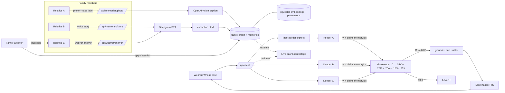

# Kin

**The family doesn't train an AI. The family remembers together.**

Kin gives a family a collective memory. Each relative has a **Keeper** grounded
only in the photos, voice notes, and stories they contributed. When a person
with early-stage dementia taps one button and asks "who is this?", the Keepers
independently retrieve evidence, a deterministic **Gatekeeper** scores it, and
Kin whispers a short cue through the phone only when the evidence agrees.
Otherwise it stays silent. A **Family Weaver** finds gaps in the family memory
graph and asks the relative most likely to know.

Kin is a family memory and reminiscence-support prototype. It is not a medical
device and makes no clinical claims.

## How it works

- Each relative has a **Keeper**, an agent grounded only in that person's
  contributed photos, voice notes, and stories.
- A deterministic **Gatekeeper** scores Keeper evidence with the formula
  `C = 0.35V + 0.25R + 0.20A + 0.15S - 0.25X`. It returns SPEAK only when
  `C >= 0.80` with agreement and provenance; otherwise it returns SILENT.
- The **Family Weaver** detects gaps in the family graph (a missing origin, an
  orphan object, an unrelated person) and asks the relative most likely to know.

## Architecture



## Stack

Next.js 14 (App Router, TypeScript), Tailwind, Supabase (Postgres + pgvector +
Storage + Realtime), face-api in the browser, OpenAI (vision, extraction,
embeddings, cue synthesis), Deepgram (STT), ElevenLabs (TTS), Vitest, Playwright.

## Surfaces

- `/family`: relatives contribute photos and stories, and answer Weaver
  questions.
- `/wearer`: one-button recall for the wearer ("Who is this?").
- `/stage`: live dashboard showing keeper scores, gate signals, and the family
  graph in real time.

## Setup

1. **Supabase**: create a project at supabase.com. In the SQL editor, run
   `supabase/migrations/001_init.sql` (it creates the schema, the `media`
   storage bucket, RLS read policies, and enables Realtime).

2. **Env vars**: `cp .env.example .env.local` and fill in Supabase URL + keys
   (Project Settings → API), `OPENAI_API_KEY`, `OPENAI_MODEL` (a current
   multimodal model), `DEEPGRAM_API_KEY`, `ELEVENLABS_API_KEY`, and
   `ELEVENLABS_VOICE_ID` (pick a calm, warm voice).

3. **Install and run**:

   ```bash
   npm install        # postinstall copies face-api weights to public/models
   npm run dev
   ```

4. **Seed**: `npm run seed` loads a small sample family so the app is usable
   immediately, or press "Seed" on `/stage`.

5. **Verify providers**: `curl localhost:3000/api/health`.

### Phones need HTTPS

Camera and microphone require a secure context. For local phone testing:

```bash
ngrok http 3000
```

and open the ngrok URL on the phone. To deploy, use Vercel (`vercel deploy`)
and set the same env vars in the project.

## Tests

```bash
npm test           # vitest: gate, keepers, synthesize, weaver
npm run test:e2e   # playwright smoke test (loads /, /family, /wearer, /stage)
```

## Responsible design

- **Early-stage only.** Kin is for people who are still independent and lose
  small pieces of everyday context. It gives the smallest possible cue so the
  wearer reconnects the dots themselves. It does not diagnose, monitor, or
  replace memory.
- **Consent for faces.** A photo cannot be submitted without checking "I have
  permission to add this person's photo to our family memory." Face
  descriptors stay in the family's own database; no face is ever sent to a
  model for identification (the vision prompt describes, never identifies).
- **Silence over guessing.** Two outcomes only: SPEAK when independent family
  evidence agrees, SILENT otherwise. There is no "I think this might be..."
- **Not a medical device.** No clinical claims, no reminders, no tracking.
  Just the family, remembering together.
